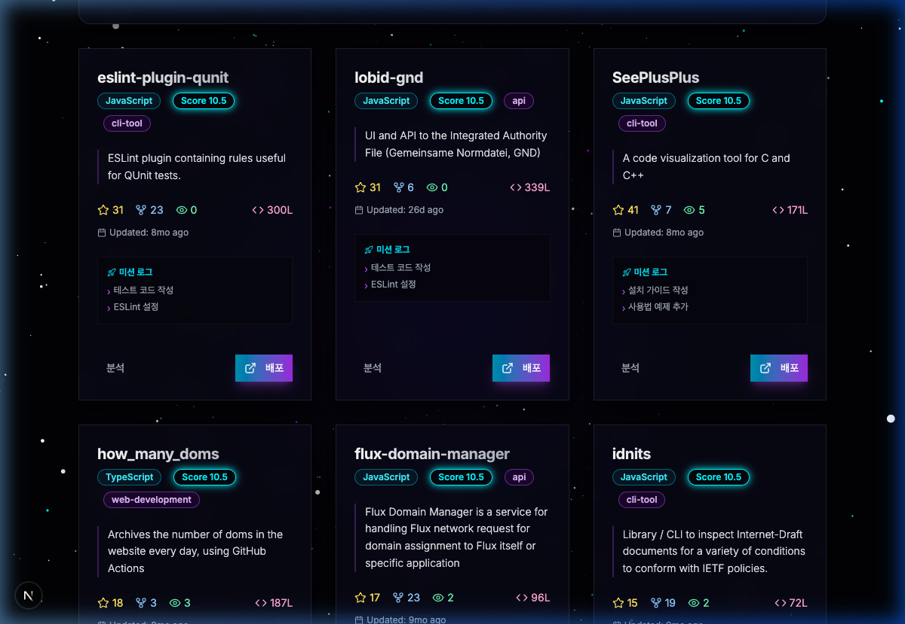
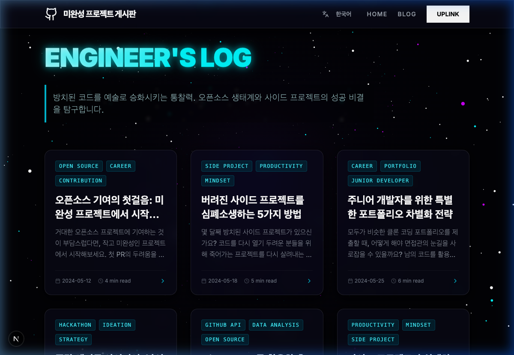
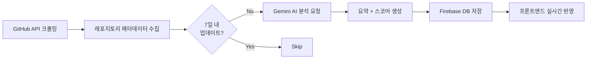

<h1 align="center">🌌 Incomplete Projects Discovery</h1>

<p align="center">
  <strong>GitHub의 미완성 프로젝트를 발견하고, AI로 분석하고, 새 생명을 불어넣으세요.</strong>
</p>

<p align="center">
  <a href="#-features">Features</a> •
  <a href="#-screenshots">Screenshots</a> •
  <a href="#%EF%B8%8F-기술-스택">Tech Stack</a> •
  <a href="#-quick-start">Quick Start</a> •
  <a href="#-아키텍처">Architecture</a> •
  <a href="#-기술적-회고--배운-것들">Retrospective</a>
</p>

<p align="center">
  
  
  
  
  
</p>

---

## 🎯 프로젝트 소개

**Incomplete Projects Discovery**는 GitHub에 흩어져 있는 **미완성/방치된 프로젝트**들을 자동으로 수집하고, **Google Gemini AI**로 잠재력을 분석하여 개발자들이 기여하거나 포크할 수 있도록 큐레이션하는 풀스택 웹 플랫폼입니다.

> *"완벽하게 다듬어진 길을 걷는 것도 좋지만, 남들이 걷다 만 잡초 무성한 길을 개척하는 것이 더 큰 배움을 줍니다."*

### 이런 문제를 해결합니다

| 문제 | 해결 |
|------|------|
| 🔍 GitHub에서 기여할 만한 프로젝트를 찾기 어려움 | AI가 잠재력 높은 미완성 프로젝트를 자동 발굴·분석 |
| 📊 프로젝트의 가치를 판단하기 위한 기준이 없음 | 10.5점 만점 스코어링 + AI 요약으로 한눈에 파악 |
| 🌐 영어 중심의 GitHub 생태계 | 한국어·영어·중국어 3개 국어 지원 |
| 📝 오픈소스 생태계에 대한 인사이트 부족 | 기술 블로그로 개발자 문화·전략 콘텐츠 제공 |

---

## ✨ Features

### 🛰️ 프로젝트 디스커버리 엔진
- **GitHub API 크롤링**: 주기적으로 GitHub를 스캔하여 미완성 프로젝트를 자동 수집
- **Gemini AI 분석**: 각 프로젝트의 README, 코드 구조, 기술 스택을 AI가 분석하여 요약 및 스코어링
- **다차원 필터링**: 언어, 스타 수, 최근 업데이트, AI 점수별 정교한 필터 & 정렬
- **실시간 검색**: 프로젝트명, 설명, 기술 스택, 토픽 기반 즉시 검색

### 🔐 사용자 경험
- **GitHub 소셜 로그인**: Firebase Authentication을 통한 원클릭 인증
- **북마크 시스템**: 관심 프로젝트를 저장하고 나만의 컬렉션 관리
- **반응형 디자인**: 모바일부터 데스크톱까지 완벽 대응

### 🎨 프리미엄 UI/UX
- **3D Galaxy 배경**: Canvas API 기반 1,500개의 별이 마우스에 반응하는 인터랙티브 은하 배경
- **Glassmorphism 디자인 시스템**: 반투명 글래스 패널, 네온 그로우, 3D 카드 호버 효과
- **다국어 지원**: 한국어 🇰🇷 · English 🇺🇸 · 中文 🇨🇳 실시간 전환

### 📝 기술 블로그 (Engineer's Log)
- 사이드 프로젝트, 오픈소스 기여, 개발 생산성에 관한 9편의 심층 아티클
- SEO 최적화된 정적 페이지로 검색 엔진 노출 극대화
- Google AdSense 연동을 통한 수익 모델 구축

### ⚙️ 관리자 기능
- **자동 요약 스케줄러**: Cron Job 기반 프로젝트 설명 자동 갱신 시스템
- **관리자 대시보드**: 크롤링 상태, AI 분석 통계, 시스템 로그 실시간 모니터링
- **API 키 보안 관리**: 키 로테이션 및 환경변수 검증 자동화 스크립트

---

## 📸 Screenshots

### 메인 페이지 — 프로젝트 카드 그리드
<p align="center">
  
</p>

> 각 카드는 프로젝트의 **언어**, **AI 스코어**, **카테고리 태그**, **Star/Fork/Views/코드 라인 수** 등을 한눈에 보여주며, 호버 시 3D 회전 효과와 네온 글로우가 적용됩니다.

### 블로그 — Engineer's Log
<p align="center">
  
</p>

> 오픈소스 문화와 사이드 프로젝트 전략에 관한 한국어 기술 블로그. 각 포스트는 태그, 읽기 소요 시간, 날짜와 함께 카드형 UI로 배치됩니다.

---

## 🛠️ 기술 스택

| 영역 | 기술 | 선택 이유 |
|------|------|-----------|
| **프레임워크** | Next.js 15 (App Router) | SSR/SSG 혼합으로 SEO와 성능 동시 확보 |
| **언어** | TypeScript 5 | 타입 안전성과 개발 생산성 |
| **스타일링** | TailwindCSS 3 + Custom CSS | 유틸리티 기반 빠른 디자인 + Galaxy 테마 커스텀 |
| **UI 컴포넌트** | Radix UI + shadcn/ui | 접근성(a11y) 보장 + 일관된 디자인 시스템 |
| **인증** | Firebase Authentication | GitHub 소셜 로그인 즉시 연동 |
| **데이터베이스** | Firebase Realtime Database | 실시간 동기화 + Serverless 운영 |
| **AI 분석** | Google Gemini API | 코드 분석 및 자연어 요약 생성 |
| **GitHub 연동** | Octokit (GitHub REST API) | 레포지토리 메타데이터 수집 |
| **차트** | Recharts 2 | 데이터 시각화 (관리자 대시보드) |
| **배포** | Vercel | GitHub 연동 자동 배포 + Edge Network |
| **광고** | Google AdSense | 서비스 수익 모델 |

---

## 🚀 Quick Start

### 사전 요구 사항

- Node.js 18+
- npm 또는 yarn
- Firebase 프로젝트 (Realtime Database 활성화)
- GitHub Personal Access Token
- Google Gemini API Key

### 1. 프로젝트 클론 및 의존성 설치

```bash
git clone https://github.com/gogoonbuntu/Incomplete-proj.git
cd Incomplete-proj
npm install
```

### 2. 환경변수 설정

`.env.example`을 참고하여 `.env.local` 파일을 생성하세요.

```bash
cp .env.example .env.local
```

```env
# GitHub API
GITHUB_TOKEN=your_github_personal_access_token

# Gemini AI API
GEMINI_API_KEY=your_gemini_api_key

# Firebase (Client-side)
NEXT_PUBLIC_FIREBASE_API_KEY=your_firebase_api_key
NEXT_PUBLIC_FIREBASE_AUTH_DOMAIN=your_firebase_auth_domain
NEXT_PUBLIC_FIREBASE_PROJECT_ID=your_firebase_project_id
NEXT_PUBLIC_FIREBASE_DATABASE_URL=your_firebase_database_url
NEXT_PUBLIC_FIREBASE_MESSAGING_SENDER_ID=your_messaging_sender_id
NEXT_PUBLIC_FIREBASE_APP_ID=your_firebase_app_id

# Firebase Admin (Server-side)
FIREBASE_SERVICE_ACCOUNT_KEY=your_service_account_key_json
FIREBASE_DATABASE_URL=your_firebase_database_url
FIREBASE_STORAGE_BUCKET=your_firebase_storage_bucket

# Google AdSense (선택)
NEXT_PUBLIC_GOOGLE_ADSENSE_CLIENT=your_adsense_client_id
```

### 3. 개발 서버 실행

```bash
npm run dev
# → http://localhost:3721 에서 확인
```

### 4. 프로덕션 빌드

```bash
npm run build
npm start
```

---

## 🏗 아키텍처

```
┌──────────────────────────────────────────────────────────────┐
│                     Client (Browser)                         │
│  ┌───────────┐  ┌──────────┐  ┌───────────┐  ┌───────────┐  │
│  │ HomePage  │  │ Project  │  │  Blog     │  │ Bookmarks │  │
│  │ (Discover)│  │ Detail   │  │ (SSG)     │  │ (Auth)    │  │
│  └─────┬─────┘  └────┬─────┘  └───────────┘  └─────┬─────┘  │
│        │              │                              │        │
│  ┌─────┴──────────────┴──────────────────────────────┴────┐  │
│  │           Galaxy Background (Canvas 2D)                │  │
│  │           1,500 Stars • Mouse Parallax • Scroll Speed  │  │
│  └────────────────────────────────────────────────────────┘  │
└──────────────────────────┬───────────────────────────────────┘
                           │
                    ┌──────┴──────┐
                    │  Next.js    │
                    │  API Routes │
                    └──────┬──────┘
            ┌──────────────┼──────────────┐
            │              │              │
      ┌─────┴─────┐ ┌─────┴─────┐ ┌──────┴──────┐
      │  GitHub   │ │  Gemini   │ │  Firebase   │
      │  API      │ │  AI API   │ │  Admin SDK  │
      │ (Octokit) │ │ (분석/요약)│ │  (DB/Auth)  │
      └───────────┘ └───────────┘ └─────────────┘
```

### 주요 디렉토리 구조

```
IncompleteProj/
├── app/                    # Next.js App Router
│   ├── page.tsx            # 메인 엔트리
│   ├── layout.tsx          # 글로벌 레이아웃 (Galaxy BG, Providers)
│   ├── blog/               # 블로그 페이지 (SSG)
│   ├── project/            # 프로젝트 상세 페이지
│   ├── bookmarks/          # 북마크 페이지
│   ├── admin/              # 관리자 대시보드
│   └── api/                # API 라우트
│       ├── crawl/          # GitHub 크롤링 엔드포인트
│       ├── cron/           # 자동 요약 업데이트 스케줄러
│       └── status/         # 시스템 상태 조회
├── components/             # React 컴포넌트
│   ├── home-page.tsx       # 메인 페이지 (필터, 검색, 카드 그리드)
│   ├── project-card.tsx    # 프로젝트 카드 (3D 호버, AI 요약)
│   ├── galaxy-background.tsx # Canvas 기반 은하 배경
│   ├── header.tsx          # 네비게이션 (다국어, 인증)
│   └── ui/                 # shadcn/ui 기반 디자인 시스템
├── hooks/                  # Custom React Hooks
│   ├── use-auth.tsx        # Firebase 인증 상태 관리
│   ├── use-bookmarks.tsx   # 북마크 CRUD
│   └── use-language.tsx    # 다국어 (ko/en/zh)
├── lib/                    # 비즈니스 로직
│   ├── services/           # 핵심 서비스 레이어
│   │   ├── project-service # CRUD + 크롤링 진행상황
│   │   ├── summary-generator # Gemini AI 요약 생성
│   │   └── github-service  # GitHub API 연동
│   └── blog-data.ts        # 블로그 포스트 데이터 (SSG)
├── services/               # 서버사이드 서비스
├── scripts/                # 운영 스크립트
│   ├── integrated-updater  # 통합 자동 업데이터
│   ├── rotate-keys         # API 키 보안 로테이션
│   └── verify-env          # 환경변수 검증
└── types/                  # TypeScript 타입 정의
```

---

## 📊 자동 프로젝트 분석 시스템

이 플랫폼의 핵심 엔진은 **자동 프로젝트 분석 파이프라인**입니다.



### 분석 프로세스
1. **대상 선정**: `lastSummaryUpdate` 기준으로 가장 오래된 프로젝트를 우선 처리
2. **AI 분석**: 프로젝트의 README, 설명, 코드를 Gemini API에 전달하여 구조화된 요약 생성
3. **Rate Limiting**: 일일 API 호출 50회 제한으로 비용 관리
4. **자동 리셋**: 모든 프로젝트가 7일 이내 업데이트 완료 시 자동 사이클 재시작

---

## 🎓 기술적 회고 · 배운 것들

이 프로젝트를 기획하고 개발하며 얻은 인사이트를 기획자와 개발자의 시선으로 정리합니다.

### 🎨 기획자 관점

#### 1. "미완성"이 곧 기회다
방치된 프로젝트를 "실패"가 아닌 **"잠재력"**으로 재정의한 것이 이 서비스의 핵심 가치입니다. 기존 GitHub Explore가 "잘 되는 프로젝트"를 보여준다면, 이 서비스는 **"도움이 필요한 프로젝트"**를 큐레이션합니다. 시장의 빈틈(Gap)을 발견하고 사용자의 숨겨진 니즈(Need)를 정의하는 것이 서비스 기획의 첫걸음이라는 것을 실감했습니다.

#### 2. 콘텐츠 전략으로 유입 설계하기
단순한 도구(Tool)형 서비스에 블로그 콘텐츠를 결합한 것은 **SEO 기반 유기적 유입(Organic Traffic)** 전략입니다. "오픈소스 기여 방법", "사이드 프로젝트 관리" 같은 검색 키워드로 블로그에 유입된 사용자가 자연스럽게 메인 서비스를 발견하도록 퍼널(Funnel)을 설계했습니다. AdSense 연동을 통해 콘텐츠 자체로도 수익 모델을 구축한 점이 핵심입니다.

#### 3. 다국어는 첫날부터
한국어만으로 시작하더라도 **처음부터 다국어 구조(i18n Infrastructure)**를 설계하면 글로벌 확장 비용이 극적으로 줄어듭니다. 나중에 도입하면 모든 하드코딩된 문자열을 찾아 교체해야 하는 악몽이 기다립니다.

### 🔧 개발자 관점

#### 1. Canvas API로 몰입형 배경 구현하기
1,500개의 별을 3D 투영(Perspective Projection)으로 렌더링하고, **마우스 움직임(Parallax)**과 **스크롤 속도**에 반응하는 인터랙티브 Galaxy 배경을 구현했습니다. `requestAnimationFrame` 기반 애니메이션 루프에서 메모리 누수를 방지하기 위한 클린업 패턴과, `Lerp`(선형 보간)를 사용한 마우스 추적 부드러움 처리를 학습했습니다.

```typescript
// Lerp를 이용한 부드러운 마우스 추적
mouseX += (targetMouseX - mouseX) * 0.05
mouseY += (targetMouseY - mouseY) * 0.05
```

#### 2. Firebase Realtime DB의 장단점 체감
Firebase Realtime Database는 프로토타이핑에 최적이지만, **복잡한 필터링과 정렬을 동시에 적용하는 쿼리**에 한계가 있습니다. 결국 클라이언트 사이드에서 전체 데이터를 받아온 뒤 JavaScript로 필터링/정렬하는 전략을 택했고, 이는 데이터 규모가 작을 때 유효하지만 확장성 측면에서는 Firestore나 PostgreSQL로의 마이그레이션이 필요하다는 교훈을 얻었습니다.

#### 3. Gemini API Rate Limiting 전략
외부 API의 호출 제한에 대응하는 패턴을 학습했습니다:
- **일일 호출 카운터**: `canMakeApiCall()` 가드로 50회/일 제한 준수
- **순차적 배치 처리**: 한 번에 하나의 프로젝트만 분석 → 7일 주기로 전체 순환
- **Graceful Degradation**: API 실패 시 기존 데이터를 유지하고, 다음 사이클에서 재시도

#### 4. Next.js App Router에서 SSR/SSG 혼합 전략
같은 앱 안에서 **동적 페이지(SSR)**와 **정적 페이지(SSG)**를 혼합 배포하는 법을 터득했습니다:
- 메인 페이지: 클라이언트 사이드 렌더링 (Firebase 실시간 데이터)
- 블로그: 빌드 타임에 정적 생성 (검색 엔진 최적화)
- API 라우트: 서버사이드에서 Firebase Admin SDK 활용

#### 5. CSS 커스텀 속성으로 디자인 시스템 구축하기
Glassmorphism, Neon Glow, 3D Card 효과 등 복잡한 시각 효과를 **CSS 변수와 유틸리티 클래스**로 추상화하여 일관된 디자인 시스템을 구축했습니다:

```css
.glass-panel {
  background: rgba(10, 10, 25, 0.6);
  backdrop-filter: blur(15px) saturate(180%);
  border: 1px solid rgba(255, 255, 255, 0.1);
  box-shadow: 0 8px 32px 0 rgba(0, 0, 0, 0.8);
}
```

#### 6. 환경변수 보안 관리 자동화
프로덕션 배포 시 환경변수 누락으로 발생하는 장애를 방지하기 위해 **빌드 전 자동 검증 스크립트**(`scripts/verify-env.js`)를 prebuild 훅에 연결하고, API 키 노출을 탐지하는 로테이션 스크립트(`scripts/rotate-keys.js`)를 구현했습니다.

---

## 📡 배포 가이드

### Vercel 배포 (권장)

1. GitHub에 코드를 Push
2. [Vercel](https://vercel.com)에서 레포지토리 Import
3. Environment Variables에 모든 환경변수 등록
4. Deploy 클릭 → 자동 HTTPS 배포 완료

> ⚠️ `FIREBASE_SERVICE_ACCOUNT_KEY`는 JSON 문자열로 stringify 후 등록하세요.

자세한 배포 가이드는 [VERCEL_DEPLOYMENT.md](VERCEL_DEPLOYMENT.md)를 참고하세요.

---

## 📜 사용 가능한 스크립트

| 명령어 | 설명 |
|--------|------|
| `npm run dev` | 개발 서버 실행 (port 3721) |
| `npm run build` | 프로덕션 빌드 |
| `npm start` | 프로덕션 서버 실행 |
| `npm run lint` | ESLint 코드 검사 |
| `npm run scheduler` | AI 요약 통합 업데이터 실행 |
| `npm run update-summaries` | 수동 프로젝트 요약 업데이트 |
| `npm run verify-env` | 환경변수 유효성 검증 |

---

## 🔒 보안

보안 관련 사항은 [SECURITY.md](SECURITY.md)를 참고하세요.

- Firebase Security Rules로 데이터베이스 접근 제어
- 서버사이드 API 라우트에서 민감한 키 처리
- 환경변수 자동 검증 및 키 로테이션 스크립트 제공

---

## 🤝 기여하기

1. **Fork** → 2. **Feature Branch** (`git checkout -b feature/amazing-feature`) → 3. **Commit** → 4. **Push** → 5. **Pull Request**

모든 기여를 환영합니다! 이슈를 등록하거나 PR을 보내주세요.

---

## 📄 License

[MIT](LICENSE) © Incomplete Projects Discovery

---

<p align="center">
  <sub>
    <strong>Built with ❤️ and lots of ☕</strong><br/>
    미완성의 예술품보다 작동하는 쓰레기가 가치 있다 — 그래서 이것은 작동합니다.
  </sub>
</p>
